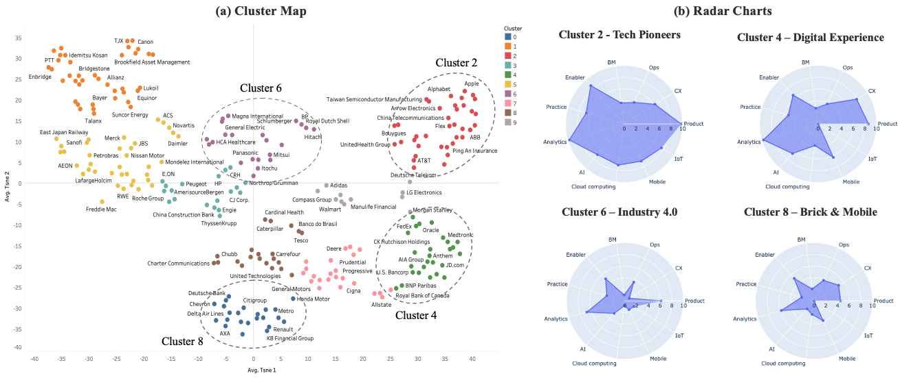

# earnings_calls_NLP - COLING 2020

Al-Ali, A. G., Sull, D., and Phaal, R.  (2020) Deep Learning Framework for Measuring the Digital Strategy of Companies from Earnings Calls, in The 28th International Conference on Computational Linguistics (COLING 2020). Link to paper: https://www.aclweb.org/anthology/2020.coling-main.80/

This repository includes the work published at Computational Linguistics 2020 paper on extracting the digital transformation strategy of Fortune 500 companies from earnings calls transcripts. This work includes the following folders:

- Converting around 5000 earnings calls transcripts from pdf format to a single dataframe
- Building two text classifiers to classify the digital strategy and its maturity (Aspect based maturity analysis)
- Clastering of the classification results to identify the digital strategy patterns of Fortune's Global 500 companies
- Visualize the digital strategy patterns

High-level illustration of the project pipeline:

