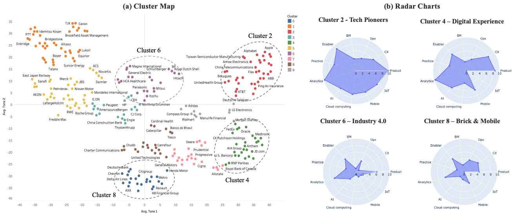
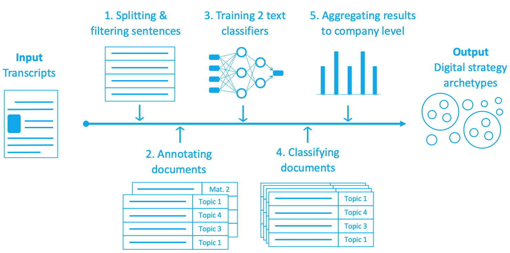

# earnings_calls_NLP
This repository includes my work on extracting the digital transformation strategy of Fortune 500 companies from earnings calls transcripts. This work includes the following folders:

- Converting around 5000 earnings calls transcripts from pdf format to a single dataframe
- Building two text classifiers to classify the digital strategy and its maturity (Aspect based maturity analysis)
- Clastering of the classification results to identify the digital strategy patterns of Fortune's Global 500 companies
- Visualize the digital strategy patterns

High-level illustration of the project pipeline:

